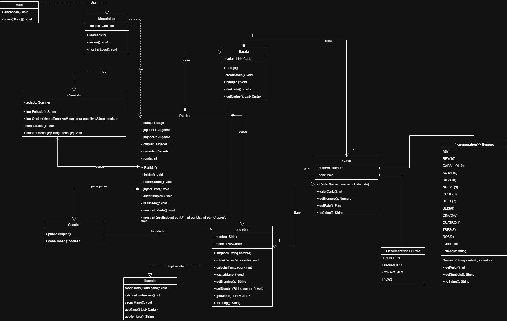

# Práctica - BlackJack - Jorge González Burgos - 1ºDAM

## Estructura del proyecto:

* `Baraja` y `Carta` se encargan de gestionar el mazo y las 52 cartas. `Carta` utiliza los Enum de `Numero` y `Palo`, y cuando
`Baraja` crea la lista de cartas (la baraja en sí misma), se encarga de recorrer cada Enum de `Numero` y `Palo` para crear las 52
cartas. `Baraja` tambiém se encarga de mezclar las cartas con el método `barajar()` y de dar una carta a quien le llame con el método `darCarta()`.

* He utilizado una interfaz `IJugador` para definir las acciones básicas que cualquier jugador puede llevar a cabo, con los métodods `robarCarta(Carta carta)`,
`calcularPuntuacion()`, `vaciarMano()`, `getMano()` y `getNombre()`. La clase `Jugador` implementa la interfaz y tiene un nombre y una lista de cartas (mano). De esta hereda `Crupier`, que no es
más que otro jugador cuyo comportamiento está programado con el método `debeRobar()`, que calcula la puntuación y si esta es mayor que 17, se detiene.

* He usado una clase `Consola` que se encarga de leer todas las entradas de teclado y mostrar por consola los resultados. He incluido las funcionalidades de `leerEntrada()` para devolver una cadena de
caracteres introduciza por el usuario, `leerOpcion(char affirmativeValue, char negativeValue)` para que el usuario pueda tomar decisiones a lo largo del juego. Este método lo uso en el juego para que
devuelva *true* si el usuario quiere robar una carta, escribiendo 'S' o 's' por consola, y *false* si escribe 'N' o 'n'. Para ello utilizo el método auxiliar `leerCaracter()`. Por último, la consola
tiene un método `mostrarMensaje(String mensaje)` que servirá directamente para mostrar mensajes por consola, y evitar el uso de *println*, unificando la funcionalidad en la clase `Consola`.
Además de la consola, utilizo una clase `MenuInicio` para dibujar un menú principal que simula la pantalla de título de un videojuego, dando la opción de jugar o salir del programa y gestionando la
respuesta del usuario. Para ello utilizo los métodos `mostrarLogo()` e `iniciar()`. Este último llamará a iniciar la partida en caso de que el usuario elija la opción *1 - Jugar*.

* Para terminar, la clase que se encarga de gestionar todo el flujo y la lógica del programa es `Partida`, esta instancia una baraja, una consola, tres jugadores (jugador 1, jugador 2 y crupier) y un
atributo para llevar la cuenta de las rondas de una partida. La clase `Main` se encarga de llamar a `MenuInicio` y que este inicie la partida llamando al método `partida.iniciar()`.



El flujo de la partida va así:

---

## Flujo del programa en `Partida`:

🔹 `iniciar()`: Vacía la mano de los jugadores (por si no es la primera partida que se juega), pregunta por un nombre para cada jugador (menos el crupier) y llama a ...

🔹 `repartirCarta()`: Se encarga de repartir las cartas iniciales a cada jugador. En mi juego cada jugador empieza con dos cartas en la mano, haciendo posible empezar directamente con 21 puntos.

🔸 Volvemos a `iniciar()`, que llama a ...

🔹 `jugarTurno()`: Se encarga de la lógica completa del turno de los jugadores (jugables). Para que sea justo, primero se pregunta a cada jugador si quiere robar una carta (a no ser que ya tenga 21 puntos
o más) y luego se reparten a ambos jugadores a la vez. Se incrementa el contador de rondas y para mostrar el estado de la ronda con las puntuaciones se llama a `mostrarEstado()`.

🔸 Volvemos a `iniciar()`, que ahora llama a ...

🔹 `jugarCrupier()`: Como el crupier es una entidad no jugable en el programa, hay que programar su comportamiento en cada turno, así que este método se encarga de pedir carta si su puntuación es 
menor de 17 o plantarse, mostrando siempre después de haber terminado el turno de los jugadores, el estado del crupier.

🔸 Volviendo por úlima vez a `iniciar()`, ahora llama a ...

🔹 `resultado()`: Se encarga de comparar las puntuaciones de los jugadores y determinar el resultado de la partida (para mostrarlo por consola utiliza el método `mostrarResultado()`). La forma de
determinar el ganador en mi código es comparar primero la puntuación entre los dos jugadores y determinar quién de los dos gana entre ellos, nombrando a uno como jugador superior. Después se compara 
a este con el crupier, y se determina finalmente si ha ganado uno, otro, o si han quedado empatados.

---

## Ejemplo de ejecución real:


```

----------------------------------
             Blackjack            
Jorge González Burgos - 1ºDAM
----------------------------------
------------
- 1. Jugar -
- 2. Salir -
------------

1
----- PARTIDA INICIADA -----
----- MAZO BARAJADO -----
Introduce el nombre del Jugador 1:
Jorge
Bienvenido Jorge.
Introduce el nombre del Jugador 2:
Diego
Bienvenido Jorge.

-----ESTADO DE LA MESA: RONDA 1-----
Crupier: 
[3 ♥, K ♥]
Puntuación: 13

Jorge:
[8 ♦, 4 ♥]
Puntuación: 12
------------------------------

Diego:
[3 ♠, 10 ♦]
Puntuación: 13
------------------------------

Jorge, ¿Quieres robar carta? (S/N)
s
Diego, ¿Quieres robar carta? (S/N)
s

-----ESTADO DE LA MESA: RONDA 2-----
Crupier: 
[3 ♥, K ♥]
Puntuación: 13

Jorge:
[8 ♦, 4 ♥, 6 ♥]
Puntuación: 18
------------------------------

Diego:
[3 ♠, 10 ♦, Q ♠]
Puntuación: 23
------------------------------

Jorge, ¿Quieres robar carta? (S/N)
n

-----ESTADO DE LA MESA: RONDA 3-----
Crupier: 
[3 ♥, K ♥]
Puntuación: 13

Jorge:
[8 ♦, 4 ♥, 6 ♥]
Puntuación: 18
------------------------------

Diego:
[3 ♠, 10 ♦, Q ♠]
Puntuación: 23
------------------------------


-----TURNO DEL CRUPIER: Ronda 3-----
Mano del crupier: [3 ♥, K ♥, 6 ♣]
Puntuación crupier: 19

----- RESULTADOS: -----
Jorge: 18
Diego: 23
Crupier: 19
------------------------

La victoria es para el crupier.

----------------------------------
             Blackjack            
Jorge González Burgos - 1ºDAM
----------------------------------
------------
- 1. Jugar -
- 2. Salir -
------------

2
Saliendo...

```

El programa empieza con el menú inicial, cuando elegimos jugar nos pregunta el nombre del jugador 1 y el del jugador 2.

En esta partida, los dos jugadores roban carta en su primer turno.

Por desgracia, el jugador 2 llega hasta 23 puntos con su tercera carta, mientras que el jugador 1 se mantiene con 18 y decide no robar más cartas.

Todo este rato se muestra la información del crupier y sabemos que tiene 13 puntos, así que ahora que los dos jugadores han terminado de jugar, es el turno del crupier, que comienza la ronda 3 y consigue ganar la partida con 19 puntos.

Después de una terrible derrota doble, mejor salir del programa...


